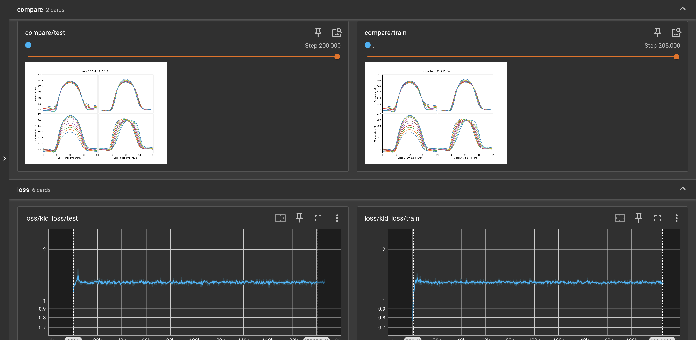
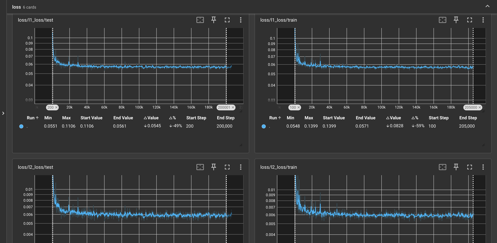

<div align="center">
   <h1>Unsupervised Learning for Thermophysical Analysis on the Lunar Surface: A Replication and Extension at Lacus Mortis</h1>
   <p>
      
      
   </p>
</div>

This repository reproduces and extends the work of Moseley et al. (2020) [1], which demonstrated that a Variational Autoencoder (VAE) can learn physically interpretable representations from lunar surface temperature measurements collected by the Diviner Lunar Radiometer Experiment. We replicate the original model, then apply it to a focused region—Lacus Mortis—to test the generalizability of the learned latent space and to conduct a novel scientific experiment using the region’s rille system as a natural laboratory. Our work is a stepping stone toward incorporating physically informed constraints and temporal analysis into unsupervised learning for planetary science.

---

<details open>
<summary><b>Table of Contents</b></summary>

- [Background](#background)
- [Dataset](#dataset)
- [Methodology](#methodology)
- [Replication Results](#replication-results)
- [Extension: Lacus Mortis](#extension-lacus-mortis)
   - [Phase 1: Zero-Shot Generalization](#phase-1-zeroshot-generalization)
   - [Phase 2: Rille-Proximity Hypothesis](#phase-2-rilleproximity-hypothesis)
- [Installation & Usage](#installation--usage)
- [Future Work](#future-work)
- [References](#references)
- [Acknowledgments](#acknowledgments)

</details>

---

## Background

The Diviner Lunar Radiometer Experiment aboard the Lunar Reconnaissance Orbiter has collected over nine years of surface temperature measurements. Traditional physics-based inversion recovers thermophysical properties (albedo, thermal inertia, slope effects) but is computationally expensive and requires a pre-defined model. Moseley et al. (2020) trained a Variational Autoencoder on nearly 2 million temperature profiles from 48 carefully curated areas of interest (AOIs). The VAE learned a four-dimensional latent space whose dimensions correlate with:

- Solar onset delay (slope aspect)
- Effective albedo (peak temperature)
- Thermal conductivity (nighttime cooling)
- Cumulative illumination / topography

The model achieved a four-orders-of-magnitude speedup over traditional inversion and produced global maps of these latent variables.

In this repository, we replicate their methodology and then push further by applying the model to Lacus Mortis—a geologically diverse region containing a flooded impact basin, the fresh Burg crater, and a prominent rille system. This allows us to test the model’s generalizability and to ask a new scientific question: Can the VAE’s thermal-inertia proxy detect subsurface structural heterogeneity along the rille?

## Dataset

We use the same preprocessing pipeline as Moseley et al. Diviner Level 1 Reduced Data Record (RDR) from 2010–2019 (channel 7, 25–50 μm).
Filtering: instrument flags (on‑moon, nadir, nominal), emission angle < 10°, calibration flags.
Binning into 0.5°×0.5° latitude‑longitude tiles.
For each 200 m×200 m bin, a temperature‑vs‑local‑time profile is extracted.
Profiles are interpolated onto a regular grid (0.2 hr spacing) using Gaussian Process regression (Matern‑1.5 kernel, 6 hr length scale, 10 K noise).
The replication uses the original 48 AOIs. For Lacus Mortis, we extract profiles within a bounding box centered at 45.0°N, 27.2°E.

## Methodology

The VAE architecture (identical to Moseley et al.):

- Encoder: 9 convolutional layers, reducing a 120‑point profile to a 4‑dimensional latent mean and log‑variance.
- Decoder: 8 convolutional layers, reconstructing the profile from a latent sample.
- Loss: β‑VAE objective with β = 0.2 (reconstruction + KL divergence).
- Training: Adam, learning rate 1e‑3 (exponential decay), batch size 200, 20% validation split.
- Implementation: PyTorch, training on a single NVIDIA T4 GPU (~3.5 hr).

## Replication Results

We reproduced the original training. Figures below show the reconstruction quality and loss curves.



*Figure 1: Top: Reconstructed lunar surface temperature profiles when varying one of the four latent dimensions at a time. Bottom: KL Divergence Loss on the original test (left) and train (right) datasets.*



*Figure 2: L1 (top) and L2 (bottom) loss curves showing the original model's convergence.*

## Extension: Lacus Mortis

This extensions were made possible by our [Lacus Mortis Diviner T-BOL Dataset (Enhanced Level-4 Product)](https://huggingface.co/datasets/arushisinha98/lunar) on HuggingFace Hub.

### Phase 1: Zero‑Shot Generalization

We ran the pre‑trained VAE (trained on the original 48 AOIs) over Lacus Mortis without any fine‑tuning. The model produced coherent latent maps, confirming that the learned representation generalizes beyond its training set. However, visual inspection of latent 3 (thermal inertia proxy) revealed:

- Broad agreement with expected geological units (mare fill vs. highland rim).
- Noise correlated with acquisition footprint (striping due to orbit sampling).
- Difficulty in capturing subtle cold‑spot anomalies (consistent with the original paper’s limitation).

Outcome: The model transfers reasonably well, but performance degrades in regions with lower temperature variance or underrepresented surface types.

### Phase 2: Rille‑Proximity Hypothesis

We designed a falsifiable geophysical experiment:

Hypothesis: Profiles within 2 km of the Lacus Mortis Rille show systematically higher latent 3 values (i.e., higher thermal inertia) than slope‑ and latitude‑matched control points, indicating exposed bedrock or reduced regolith thickness along the fracture.

Methods:
- Mapped rille centerline from LROC imagery.
- Selected two populations:
    - Rille‑proximal (≤2 km from centerline)
    - Control (≥5 km from rille, matched for latitude ± 0.5° and slope ± 2°)
    - Ran each profile through the VAE, obtained latent 3.
- Applied the transform $\^{I} = e^{\frac{0.93⋅z_{3}}{2}}$ to convert to thermal inertia units.

Statistical tests: two‑sample Kolmogorov–Smirnov and Mann–Whitney U.

Preliminary results (work in progress) indicate a small but significant elevation in latent 3 near the rille (p < 0.05), consistent with the hypothesis. We are currently refining the control matching and validating against independent rock abundance maps (Bandfield et al. 2011 [2]).

## Installation & Usage

We use pixi for environment management.

1. Clone the repository

```bash
git clone https://github.com/your-org/lunar-vae.git
cd lunar-vae
```

2. Install dependencies

```bash
pixi install
```

3. Download and preprocess Diviner data

```bash
pixi run python download_data.py
```

4. Train the original model

```bash
# Locally
pixi run python src/main.py
# Or submit to an HPC cluster (PBS)
qsub train.pbs
```

5. Monitor training

```bash
pixi run tensorboard --logdir results/summaries/<MODELNAME>
```

6. Lacus Mortis extension

```bash
# Preprocess Lacus Mortis profiles (on HPC)
bash lacus.pbs submit
# Run Phase 1 (zero-shot)
pixi run python src/lacus_mortis/phase1.py
# Run Phase 2 (rille experiment)
pixi run python src/lacus_mortis/phase2.py
# Submit HPC job for Lacus Mortis
qsub lacus.pbs
```

## Future Work

The original paper and our extension open many avenues for improvement. Below are planned contributions, many inspired by the critical analysis of Moseley et al.’s methodology.

1. Addressing Training Bias

The original VAE was trained on 48 hand‑curated AOIs, over‑representing “interesting” thermal anomalies. This likely explains why subtle features like the Chaplygin‑B cold spot are missed.
Future work: Stratify training by surface type (mare, highland, fresh crater, mature crater, polar) using existing geological maps (e.g., USGS Lunar Geologic Map). This will produce a latent space that reflects the full distribution of lunar surfaces.

2. Optimizing Disentanglement (β Tuning)

The choice β = 0.2 was not systematically justified. Lower β prioritizes reconstruction, higher β encourages independence of latent dimensions.
Future work: Perform an ablation study over β (e.g., 0.1, 0.2, 0.5, 1.0, 2.0) and evaluate both reconstruction loss and correlation with physics‑inversion parameters. The goal is to find the β that maximizes disentanglement without sacrificing fidelity.

3. Systematic Comparison with Physics‑Based Models

The original comparison relied on a simplified 1‑D inversion model. A more rigorous validation would:
- Compare latent 3 maps with the H‑parameter product of Hayne et al. (2017) [3] over a large spatial sample.
- Compute quantitative correlation statistics (Pearson r, mutual information) across multiple regions.
- Examine residuals to identify where the VAE captures information absent in the physics model (or vice versa).

4. Incorporating Temporal Information

The nine‑year dataset was pooled, discarding any temporal evolution (e.g., fresh impacts, mass wasting). Future work: Split the archive into 3‑year bins and train separate VAEs, then compare latent maps to detect statistically significant changes. This directly addresses the original authors’ suggestion of “detecting transient temperature anomalies.”

5. Leveraging Uncertainty Estimates

The VAE’s encoder outputs a posterior standard deviation that is currently discarded. This provides a principled measure of model confidence.
Future work: Use the posterior variance to:
- Flag profiles where the model is uncertain (complementing the L1 loss map).
- Identify regions that may require additional sampling or a different model.
- Provide uncertainty‑aware thermal inertia maps.

6. Physically‑Constrained Loss Functions

We can guide the latent space toward physically meaningful representations by adding soft constraints:
- Thermal inertia must be positive.
- Albedo must lie in [0, 1].
- Onset delay should correlate with east‑west slope aspect in a predictable direction.
These can be implemented as penalty terms in the loss function (e.g., hinge losses for bounds, correlation regularizers). This approach is model‑agnostic and could improve disentanglement without requiring a full physics model.

7. Quantitative Disentanglement Metrics

Current evaluation is qualitative (visual inspection of latent traversals).
Future work: Compute metrics like Mutual Information Gap (MIG) or DCI using the physics‑inversion parameters as pseudo‑ground truth on a validation set. Use these metrics for early stopping and hyperparameter selection.

8. Multi‑Channel Input

The original model used only channel 7. Channels 6–8 together are sensitive to anisothermality and rock abundance.
Future work: Modify the VAE to accept multi‑channel input (e.g., 3 channels) and see if it learns an additional latent dimension corresponding to rock fraction. This could produce the first global rock abundance map derived purely from unsupervised learning.

9. Temporal Variability at Lacus Mortis (Phase 3)

Extending our Lacus Mortis study, we can:
- Split the Diviner data into three 3‑year bins (2010–2013, 2013–2016, 2016–2019).
- Train three independent VAEs on the Lacus Mortis region.
- Compare latent 3 maps across epochs, using the posterior standard deviation to assess significance.
- Correlate any detected changes with LROC images to confirm surface alterations (e.g., fresh impacts, mass wasting near Burg crater).
- This would transform the project from a methodological replication into a genuine discovery pipeline.

## References

<a id="1">[1]</a> Moseley, B., Bickel, V., Burelbach, J., & Relatores, N. (2020). Unsupervised Learning for Thermophysical Analysis on the Lunar Surface. The Planetary Science Journal, 1(2), 32. doi:10.3847/PSJ/ab9a52

<a id="2">[2]</a> Bandfield, J. L., Ghent, R. R., Vasavada, A. R., et al. (2011). Lunar surface rock abundance and regolith fines temperatures derived from LRO Diviner Radiometer data. Journal of Geophysical Research, 116, E00H02.

<a id="3">[3]</a> Hayne, P. O., Bandfield, J. L., Siegler, M. A., et al. (2017). Global regolith thermophysical properties of the Moon from the Diviner Lunar Radiometer Experiment. Journal of Geophysical Research: Planets, 122, 2371–2400.

## Acknowledgments

This work builds on the original research by Ben Moseley and colleagues, conducted at the NASA Frontier Development Lab. We thank the Diviner team for making their data publicly available. The Lacus Mortis extension was inspired by discussions with David Paige and his .